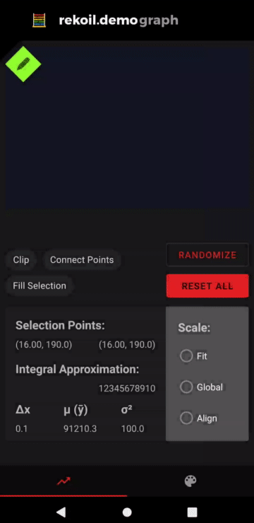

# android rekoil demo - graph
[Rekoil](https://www.github.com/musotec/rekoil) is a reactive library extending Kotlin coroutines. 
This project is the Android demo application of the library.

## What can it do?
In the following demo, there is a sequence of updates made to the __[Atoms](https://github.com/musotec/rekoil/blob/master/docs/atoms.md)__, which __provide state data__, 
that comprise the graph shown on the screen. When the Atoms are updated, __[Selectors](https://github.com/musotec/rekoil/blob/master/docs/selectors.md)__ then __transform the
data__ and update dependents reactively. This can be seen in the graph visibly, as well as in the data
views below it. When UI components are interacted with, the graph and data indicators are updated 
appropriately.

#### Demo
[](https://www.youtube.com/watch?v=qOR2nxB3C-k)

## Implementation Details

### Basic application of Core Components
Application of the core components can be seen in the [GraphTestFragment](graph/spark/src/main/java/tech/muso/demo/graph/spark/GraphTestFragment.kt).

This fragment contains the attachment of UI components and listeners to Atoms/Selectors.
It uses Subscriber Jobs to handle updating of other UI components when the graph data is updated.

This class also provides examples of Atom and Selector creation. 
As well as Rekoil Scope sharing with _withScope_ to observe changes from within the LineGraphView. 

### Advanced application of Selector logic
The [LineGraphView](graph/spark/src/main/java/tech/muso/demo/graph/spark/LineGraphView.kt) itself 
contains its own [RekoilScope](https://github.com/musotec/rekoil/blob/master/docs/scopes.md).
This scope is used to handle the drawing operations and __global rendering values__ between any lines
added to the graph.

This allows for us to maintain computed global values using Fibonacci Heaps; so that we can efficiently 
maintain the maximum and minimum across lines as their data sets change. This allows for rendering
of the lines relative to one another. So any lines with scale type "Align" or "Global" can be drawn
correctly to scale.
 
 - "Fit" simply fits the line to the graph, filling the vertical space.
 - "Global" plots the line traditionally. With lines sharing a common Y axis.
 - "Align" takes all lines with the same type and scales them relatively, so that they start at the same point.
 You can think of this as "Indexed to 100" scaling.
 
Fibonacci Heaps are used as the minimum (root node) will need to support many calls to `decrease-key`.
This heap optimizes this to `Θ(1)`, as well as having `O(log n)` amortized cost for `delete-root` (`pop-min`).
The `O(log n)` deletion needs to occur only when the global minimum/maximum changes. However, we routinely
need to increment/decrement the key value to determine if we should need to do so.
When the minimum/maximum changes, then we need to adjust the rendering of the other lines.

### Additional (more basic) applications of Rekoil Values
Finally, the [LineRekoilAdapter](graph/spark/src/main/java/tech/muso/demo/graph/spark/LineRekoilAdapter.kt) and [Line](graph/spark/src/main/java/tech/muso/demo/graph/spark/graph/Line.kt) classes use Rekoil Values and selectors to link
the data and rendering respectively together with the global information in the aforementioned LineGraphView.

These cases are simpler, and achieve basic data sources and transformations.

The LineRekoilAdapter contains a few __[Atoms](https://github.com/musotec/rekoil/blob/master/docs/atoms.md)__ to __communicate _attributes___ between the Line and the LineGraphView.
Examples of this are _clip_, _fill_, and _connect points_. Which allow for certain rendering attributes
to be controlled. As well as _data_ for the core data set to be rendered by the Line.

Using __[Selectors](https://github.com/musotec/rekoil/blob/master/docs/selectors.md)__ we then __achieve__ a few ___data set transformations___.

By combining global selection range Atoms for range indices and the data set Atom with a Selector,
we can create a transformation function. Each combination gives a transformation function that can
then be seen in the data section below the graph.

These are things like the midpoint integral approximation, average, variance, etc. Which are all derived
values from the data set and the selection bounds. 

Finally, by using Selectors in the Line class, we determine when we should redraw or recompute any 
rendering for the line. By observing the data set, global variables, or line attribute Atoms we control
everything from the position in the view or the start of an animation, to the color and thickness
of a line.

#### Footnotes
The screen capture gif for README created with the following command (roughly)

```ffmpeg -ss 00:00:02.000 -i ScreenRecording.mp4 -filter_complex "[0:v] fps=12,crop=1080:2220:0:100,scale=360:-1,split [a][b];[a] palettegen [p];[b][p] paletteuse" -t 00:00:20.000 preview.gif```

And the video cropped from the same source is achieved with

```ffmpeg -ss 00:00:02.000 -i ScreenRecording.mp4 -filter "crop=1080:2220:0:100" -t 00:00:20.000 preview.mp4```
